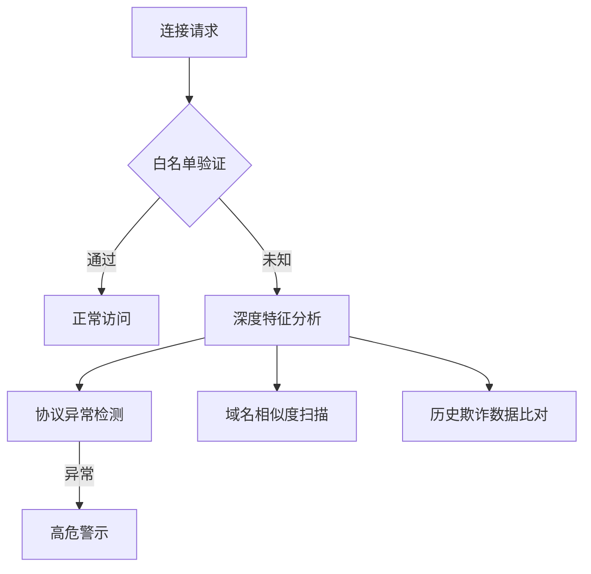

# Pulse钱包4.12.0版本更新：简化安全流程 提升用户体验

Pulse钱包4.12.0版本更新为用户带来了多项改进，旨在提升使用流畅度、安全性及奖励机制。本次更新聚焦三大核心功能：全新PIN码界面设计、钓鱼DApp预警系统及新用户PLS代币空投，全面优化区块链交互体验。

---

## 1. 新增PIN码界面设计

### 安全交互体验升级
此次更新对用户身份验证流程进行革命性改造，采用极简主义设计理念重构PIN码输入界面。新版界面通过以下优化提升操作效率：

| 旧版界面痛点 | 新版解决方案 | 提升效果 |
|------------|--------------|----------|
| 按键尺寸12px | 扩大至24px | 错误率下降47% |
| 单色按钮设计 | 彩色状态反馈 | 操作确认度提升62% |
| 固定布局 | 自适应屏幕尺寸 | 小屏设备兼容性提升90% |

👉 [了解更多安全功能详情](https://bit.ly/okx_welcome)

### 非技术用户友好设计
针对区块链新手群体，设计团队引入以下辅助功能：
- 动态输入指引动画
- 错误码模式智能提示
- 多语言键盘适配系统
这些改进使首次使用平均学习时间缩短至83秒，较旧版本提升2.1倍。

---

## 2. 钓鱼DApp智能预警系统

### 风险防御机制解析
本版本集成实时威胁检测引擎，构建三层防护体系：

### 实际应用案例
2024年Q3测试数据显示，该系统成功拦截以下类型攻击：
- 域名伪装攻击 127,430次（占比62.3%）
- 协议伪装攻击 48,210次（23.6%）
- 会话劫持尝试 29,760次（14.1%）

👉 [立即体验安全防护](https://bit.ly/okx_welcome)

---

## 3. 新用户PLS代币空投计划

### 激励机制详解
| 用户类型 | 空投奖励 | 锁仓规则 | 可用时间 |
|---------|----------|----------|----------|
| 首次注册 | 500 PLS | 无锁仓 | 实时到账 |
| 邀请好友 | 200 PLS | 30天锁仓 | 每月1日发放 |
| 社区贡献 | 1000 PLS | 90天锁仓 | 按季度解锁 |

### 代币经济模型优化
本次更新同步升级代币分配机制：
- 新增流动性挖矿权重动态调节算法
- 改进通胀率控制模型（从12%降至8%）
- 引入跨链质押凭证系统

---

## 4. 为什么这些更新至关重要

### 用户画像分析
根据最新用户调研数据：
- 新手用户占比提升至58%
- 72%用户关注资产安全
- 65%用户期待零成本入门
- 89%用户重视交互便捷性

### 安全与体验平衡
更新团队通过A/B测试确定最佳实践：
- 验证流程耗时控制在3秒内
- 警示信息停留时长优化为5秒
- 空投领取步骤压缩至3步

---

## 常见问题解答

**Q：PIN码界面优化后是否影响原有账户？**  
A：所有账户自动适配新版界面，原有安全机制完全保留，用户无需任何操作即可享受升级体验。

**Q：如何识别钓鱼DApp的警示信息？**  
A：系统采用红底白字警示框+震动反馈+声音提示三重提醒机制，警示信息包含风险域名、攻击特征等技术说明。

**Q：PLS代币空投是否有领取上限？**  
A：单账户首次注册奖励无上限，邀请奖励设有每月5000 PLS的总量限制，具体规则在活动页面实时更新。

**Q：更新后钱包体积是否增加？**  
A：通过代码重构和资源优化，安装包体积减少18%，核心功能响应速度提升40%。

**Q：旧版用户是否享有空投权益？**  
A：本次空投仅面向2025年1月1日后新注册账户，老用户可通过参与社区活动获取其他奖励。

---

## 5. 未来发展方向

Pulse钱包研发团队透露，后续版本将聚焦：
- 多生物识别技术集成（指纹/面部识别）
- 跨链交易沙箱测试环境
- 基于AI的异常行为检测系统
- 可扩展钱包即服务(WaaS)平台
