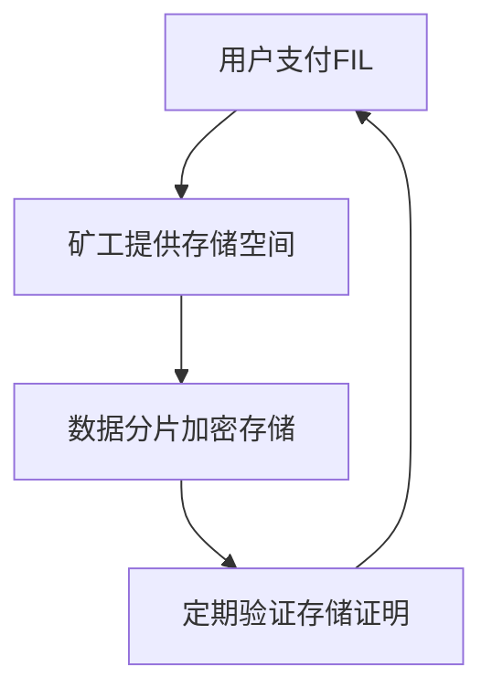

# 加密货币的主要类型及比特币替代选择

## 加密货币的核心分类解析

加密货币作为数字金融的重要组成部分，已形成多元化生态体系。除比特币外，市场涌现出众多具有独特功能的数字资产。了解其分类体系对于投资者和应用者具有重要意义。以下将系统解析主流加密货币类型及其特点：

### 主流加密货币分类体系

| 分类类型       | 核心特征                         | 代表项目                  |
|----------------|----------------------------------|---------------------------|
| Altcoins       | 创新共识机制/应用场景扩展        | Ethereum, Solana          |
| Stablecoins    | 法币/实物资产锚定                | USDT, USDC                |
| 实用代币       | 生态功能实现工具                 | Chainlink, Uniswap        |
| 治理代币       | 去中心化决策权凭证               | MakerDAO, Aave            |
| 模因币         | 社区驱动型投资标的               | Dogecoin, Shiba Inu       |

👉 [实时掌握市场动态](https://bit.ly/okx_welcome)

### 核心分类深度解读

#### Altcoins的技术革新
作为比特币替代品的Altcoins在技术创新方面表现突出：
- **共识机制突破**：以太坊转向权益证明（PoS），Solana采用历史证明（PoH）
- **性能提升**：Solana实现每秒65,000笔交易的处理能力
- **应用场景拓展**：Cardano在医疗数据管理领域的探索

#### 稳定币的金融基建作用
稳定币通过资产锚定机制解决价格波动难题：
- **法币抵押型**：USDT的1:1美元储备机制
- **加密抵押型**：DAI的超额抵押模式
- **算法稳定型**：UST的协议调节机制（历史案例）

#### 实用代币的生态价值
以Filecoin为例，其存储市场通过代币激励构建去中心化云存储网络：

#### 治理代币的DAO实践
MakerDAO的治理模式展示：
- 持币者参与抵押率调整
- 投票决定储备资产配置
- 公投处理系统风险事件

#### 模因币的社区经济现象
Dogecoin的社区运营特征：
- 每年5.2%的通胀发行机制
- 社区主导的慈善捐赠项目
- 推特话题标签驱动的价格波动

## 2025年值得关注的比特币替代资产

### 投资潜力分析（2024-2025）

| 项目         | 市值排名 | 年化涨幅 | 核心优势                  |
|--------------|----------|----------|---------------------------|
| Ethereum     | 2        | +12.3%   | 智能合约基础设施          |
| Solana       | 6        | +87.8%   | 高性能区块链架构          |
| XRP          | 4        | +360%    | 跨境支付解决方案          |
| Monero       | 27       | +71.9%   | 隐私保护技术创新          |
| Dogecoin     | 9        | +257.1%  | 社区生态活跃度            |

👉 [获取专业投资分析](https://bit.ly/okx_welcome)

### 重点项目深度解析

**以太坊**的生态优势：
- 支持超过3,000个DApps
- TVL（总锁定价值）达$180亿
- EIP-1559通缩机制持续生效

**Tron**的创新实践：
- 推出去中心化交易所TronSwap
- 用户日均交易量突破$15亿
- 与BitTorrent的生态整合

**Polygon**的Layer2布局：
- zkEVM技术实现以太坊扩容
- 与Adobe等企业的NFT合作
- 节点收益年化约4-6%

### 投资决策FAQ

**Q：如何平衡高风险代币与稳定投资？**
A：建议采用核心-卫星策略，70%配置主流币种，30%用于新兴项目布局

**Q：模因币投资需要注意哪些风险？**
A：重点关注流动性风险、社区活跃度变化及监管政策动态

**Q：如何判断区块链项目的技术价值？**
A：可从白皮书创新性、代码更新频率、开发者社区规模三个维度评估

**Q：隐私币的监管风险如何应对？**
A：选择采用零知识证明等合规技术方案的项目，分散持仓比例不超过资产的5%

**Q：跨链桥的安全性如何保障？**
A：优先选择采用多方安全计算（MPC）技术的跨链协议

## 投资策略建议

1. **技术分析维度**：关注ETH/BTC汇率变化趋势
2. **基本面评估**：项目团队背景及路线图完成度
3. **风险管理**：设置10-15%的单币种持仓上限
4. **生态观察**：关注项目合作方及应用场景落地进度

👉 [学习专业交易技巧](https://bit.ly/okx_welcome)

加密货币市场持续进化，投资者需建立动态评估体系。建议结合自身风险承受能力，通过多维度分析做出投资决策，同时关注行业监管动态和技术发展前沿，构建适应市场变化的投资组合。