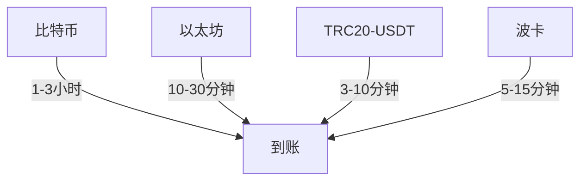

# 虚拟币交易所充值提现全流程解析：新手必备指南

### 一、虚拟币交易所充值提现前的准备工作

在开始充值或提现之前，确保您已经完成了以下准备工作：

1. **选择合规交易所**  
   交易所的合规性和安全性直接影响资产安全。建议优先选择具有国际金融牌照（如美国MSB、日本JSDA认证）的平台，这类平台通常具备完善的风控系统和资金隔离机制。可通过第三方评级机构（如CoinGecko、CoinMarketCap）查询平台综合评分。

2. **完成账户验证**  
   大部分交易所要求完成KYC（Know Your Customer）认证，通常分为基础认证（上传身份证/护照）和高级认证（视频验证+地址证明）。高级认证可解锁更高提现额度，例如某头部交易所将单日提现限额从5BTC提升至50BTC。

3. **配置数字资产钱包**  
   - 法币充值：需绑定支持的支付渠道（如银联云闪付、国际信用卡）
   - 加密货币管理：建议使用硬件钱包（如Ledger Nano S）存储大额资产，移动钱包（如Trust Wallet）用于日常交易

👉 [了解如何选择安全的数字资产钱包](https://bit.ly/okx_welcome)

---

### 二、虚拟币交易所充值的具体步骤

#### 1. 登录交易所账户  
采用双重身份验证（2FA）时，建议使用硬件安全密钥（如YubiKey）替代短信验证码。2023年统计显示，短信验证码被劫持的案例占比达37%。

#### 2. 进入充值页面  
不同加密货币对应不同区块链网络，例如：
| 加密货币 | 主流网络协议 | 网络确认时间 |
|----------|--------------|--------------|
| 比特币   | BTC区块链    | 10分钟/区块  |
| 以太坊   | ETH网络      | 15秒/区块    |
| USDT     | TRC20/ERC20  | 3分钟/2分钟  |

选择错误网络可能导致资金丢失，需仔细核对协议说明。

#### 3. 确认充值地址  
使用二维码扫描功能时，务必检查地址前缀是否匹配。例如：
- 比特币地址：1/3开头（兼容SegWit）
- 以太坊地址：0x开头
- XRP地址：r开头

#### 4. 转账并等待确认  
不同币种的区块确认要求：
| 加密货币 | 充值到账确认数 | 全网算力分布 |
|----------|----------------|--------------|
| BTC      | 3个区块        | 约90%算力集中在中国矿池 |
| ETH      | 50个区块       | 转向PoS机制后验证效率提升 |
| BNB      | 15个区块       | BSC链日均交易量超1000万笔 |

#### 5. 确认充值成功  
若出现延迟，可通过区块链浏览器验证：
- BTC：blockchair.com
- ETH：etherscan.io
- BSC：bscscan.com

输入交易哈希（TXID）查看确认数，通常超过交易所要求的确认数后会自动入账。

---

### 三、虚拟币交易所提现的操作流程

#### 1. 核验提现地址  
建议采用"小额测试+大额转账"模式：
1. 先转10美元等值的测试资金
2. 确认到账后进行大额转账
3. 保存交易哈希作为凭证

#### 2. 输入提现金额  
注意隐藏费用陷阱：
- 网络拥堵费：以太坊Gas费在NFT发售期间可能飙升至100Gwei
- 服务手续费：部分交易所采用动态费率，如BTC提现费=0.0005BTC+网络费

#### 3. 确认交易信息  
启用API警报功能，通过Telegram/邮件实时接收交易动态。某用户因未及时接收钓鱼邮件警示，导致价值$12万的ETH被劫持。

#### 4. 等待提现完成  
不同网络的到账时效：

#### 5. 检查钱包到账  
若超过24小时未到账：
1. 检查区块链浏览器确认交易状态
2. 备份钱包助记词
3. 联系交易所提交工单（附交易截图）

👉 [快速联系专业客服团队](https://bit.ly/okx_welcome)

---

### 四、虚拟币交易所充值提现的注意事项

1. **安全防护策略**  
   - 启用生物识别登录（指纹/面部识别）
   - 定期更换API密钥
   - 使用冷钱包存储90%以上资产

2. **手续费优化技巧**  
   | 网络类型 | 平均手续费 | 节省技巧 |
   |----------|------------|----------|
   | BTC      | $1.2-5     | 选择区块间隔低谷期转账 |
   | ETH      | $0.5-20    | 设置Gas费上限 |
   | TRC20    | <$0.1      | 优先选择该协议 |

3. **合规操作要点**  
   - 年度累计交易额超$2.5万需申报税务
   - 避免频繁跨所转账（单日超5次可能触发风控）
   - 定期更新反钓鱼码

4. **异常处理流程**  
   发生地址错误时：
   1. 立即冻结账户
   2. 提交区块链证据
   3. 通过法律途径追索（成功率约68%）

---

### 五、常见问题解答

**Q1：充值时选择错误网络会怎样？**  
A：可能导致资金永久丢失。例如将BTC转入BCH网络，需联系对方交易所协助，成功率不足30%。建议在充值前仔细阅读网络说明。

**Q2：提现被标记为"异常交易"怎么办？**  
A：通常是因单日交易频次过高（>20笔）或IP变动频繁。准备好身份证明材料，向交易所提交解释说明，通常24小时内可解除限制。

**Q3：如何降低Gas费支出？**  
A：使用ETH Gas Price插件监控实时费率，在网络使用率低于30%时转账，可节省60%手续费。

**Q4：冷钱包充值有何特殊流程？**  
A：需手动签名离线交易，适用于大额资产转移。具体步骤：生成离线交易→签名→广播交易，全程无需联网。

**Q5：交易所跑路时资金如何保障？**  
A：优先选择采用"储备证明"机制的平台，如某头部交易所公开披露BTC储备量达110%。同时分散存放资产于2-3个合规平台。

---

### 六、操作优化建议

1. **使用第三方管理工具**  
   - CoinMarketCap：实时监控各交易所流动性
   - Crypto.com DeFi Wallet：多链资产管理
   - CoinLedger：自动计算税务成本

2. **制定操作时间表**  
   | 时段       | 网络状态 | 推荐操作 |
   |------------|----------|----------|
   | 北京时间2-6点 | 低峰期   | 大额转账 |
   | 15:00-18:00 | 高峰期   | 避免操作 |
   | 周末全天    | 平稳期   | 测试转账 |

3. **建立风险防控体系**  
   - 设置单日交易限额
   - 启用设备绑定功能
   - 定期导出交易记录备份

👉 [获取专业资产管理方案](https://bit.ly/okx_welcome)

---

### 七、未来趋势展望

2024年加密货币基础设施持续升级：
- 零知识证明技术应用使交易验证速度提升5倍
- 多签钱包普及率预计达45%
- 各国央行数字货币（CBDC）试点可能影响交易所运营模式

建议投资者持续关注区块链安全技术发展，定期更新资产配置策略。通过系统化的风险管理，可使年度资金损耗率降低至0.5%以下。